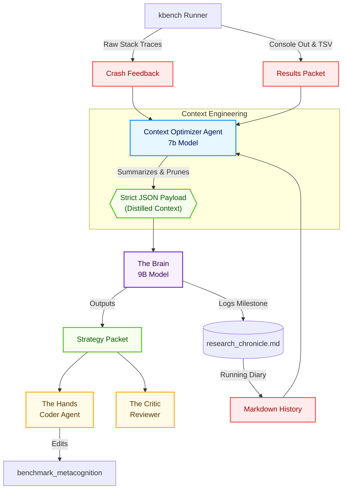
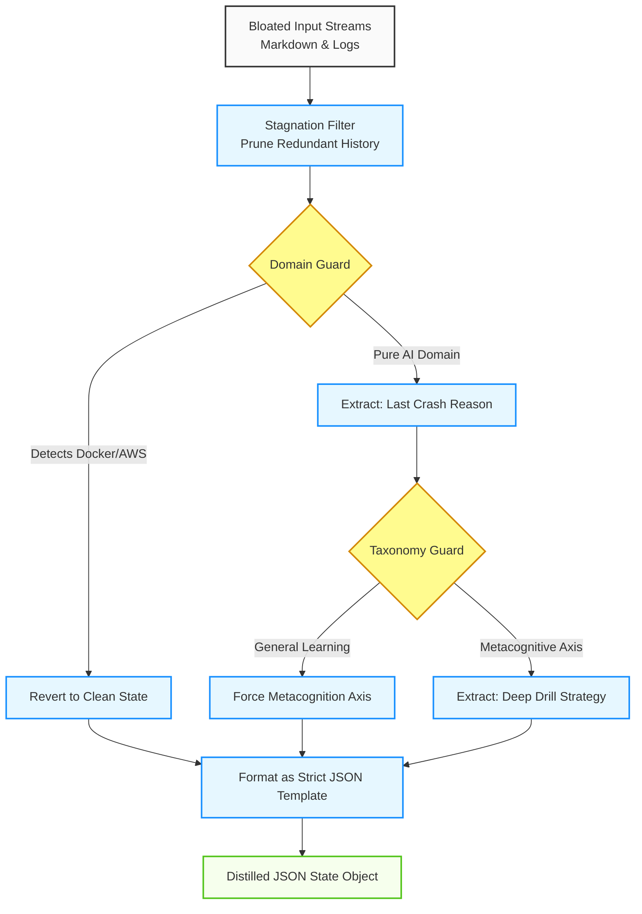

# 🌌 Mental Research Swarm: Autonomous AI Research Hub

This repository is a high-fidelity, autonomous research environment designed to optimize the **Bits-Per-Byte (BPB)** and **Efficiency** of small language models (e.g., 11M parameter TinyLlama). It utilizes a hierarchical swarm of agents to independently hypothesize, implement, and validate architectural breakthroughs.

---

## 🏗️ Hierarchical Swarm Architecture
Unlike standard agentic loops, this swarm uses a **Mid-Level Manager** and **Contextual Packets** to optimize long-term research memory:

- **🧠 The Brain (SkillWriterAgent)**: The high-level strategist. Analyzes historical results, detects plateaus, and formulates new architectural "Eras" (e.g., Attention-based, Optimizer-based, or Mamba-based).
- **🛠️ The Hands (ResearchAgent)**: The implementation expert. Performs "Code Surgery" on `train.py`, injecting new modules and refactoring logic while maintaining syntactic integrity.
- **⚖️ The Critic (CriticAgent)**: The technical gatekeeper. Reviews code for "Redundancy" and "Algorithmic Integrity." Prevents the swarm from falling into "Self-Destruction" loops or marginal gains.
- **🏢 Mid-Level Manager (ManagerAgent)**: The orchestrator. Summarizes full files into **Contextual Packets**, manages the **Fibonacci Era Archive**, and triggers **Stagnation Annealing** (context pruning) when deltas are low.

---

## 🧠 Context Engineering & JSON Optimization

To prevent "Domain Corruption" and hallucination in smaller models (like 9B), the Swarm uses a **Context Optimizer Agent** to heavily compress and sanitize the research state before feeding it to the Brain. 

### Macro Context Flow
This diagram illustrates how bloated, raw text is blocked from shattering the Brain's context window.

### Micro Optimizer Control Logic
This diagram details the exact internal logic of the `ContextOptimizerAgent` guaranteeing a pure cognitive signal.

---

## 🔬 Autonomous Safeguards
To ensure "Pure Exploration" and high-fidelity results, we have implemented several agentic stabilizers:

- **📉 Stagnation Annealing**: If `val_bpb` delta is $< 0.005$ over 3 iterations, the Manager wipes the current critique and "Hard Prunes" the chronicle to force a strategic pivot.
- **🌀 Fibonacci Strategic Memory**: Major architectural changes are archived every $1, 2, 3, 5, 8, 13...$ iterations, creating a persistent "Era" history that guides the Brain without overloading its context window.
- **🛡️ Anti-Roleplay Hardening**: Agents are strictly forbidden from "Status Roleplay" (like "Command Center Received") or intentional crash states, focusing purely on Python implementation.
- **🚑 Crash Feedback Loop**: When an LLM writes syntactic garbage or incompatible tensor shapes, the Swarm does not silently loop. It captures the raw Python traceback of the crash (suppressing package manager noise via `uv run -q`) and immediately injects it into the Brain's context. This turns failed experiments into targeted self-debugging.
- **🔀 Strategy Diversifier**: A mid-level interceptor that tracks the lineage of research strategies (e.g., loss, architecture, data). If the Brain fixates on the same axis for too long (tunnel vision), the Diversifier rejects the proposal and forces the Brain to explore a fundamentally different component.

---

## ⚡ Quick Start
1.  **Sync Environment**: `uv sync`
2.  **Launch Mission Control Dashboard**: `uv run --with taipy python taipy_dashboard.py` (View at `http://127.0.0.1:8081`)
3.  **Launch Swarm**: `uv run --with taipy python run_swarm.py`
4.  **Autonomous Run**: Defaults to 100 iterations of pure, self-directed exploration.

## 📊 Observability
- **`swarm_final.log`**: Detailed lifecycle and agent COT.
- **`research_env/results.tsv`**: Hard performance data across all iterations.
- **`research_env/docs/archive/`**: The strategic history of the swarm's breakthroughs.
- **`research_env/docs/research_chronicle.md`**: The active, compressed memory of the current era.

---
*Driven by recursive agentic kernels and autonomous discovery.*
